# 트레이더김씨 매매 — 종목별 거래대금 (키움 분봉 실측)

> 거래대금 = 해당일 **09:00 개장부터 누적**(키움 ka10080 1분봉, 단위 억원).
> 매수/매도 시각은 차트 B/S 마커 판독(±2~3분). 🔴=매수 🔵=매도.
> **선취매**=매수 후 거래대금이 더 터짐(터지기 전 진입) / **추격매**=매수 전에 이미 터짐(터진 뒤 진입).

## 📊 한눈에 보기 — 매수 직전 vs 매수 후 거래대금 (전 종목)

| 일자 | 종목 | 매수시각 | 매수 시점 누적 | 매수 직전 5분간 증가 | 매수 후 5분간 증가 | 판단 |
|---|---|---|---|---|---|---|
| 05-04 | 대원전선 | 09:06 | 955억 | +629억 | +799억 | 🟢선취매 |
| 05-04 | 삼성전자 | 11:00 | 2.66조 | +2,250억 | +855억 | 🔴추격매 |
| 05-06 | 미래에셋증권 | 09:17 | 3,112억 | +1,403억 | +651억 | 🔴추격매 |
| 05-06 | 대원전선 | 09:06 | 789억 | +500억 | +758억 | 🟢선취매 |
| 05-07 | 삼성전자 | 09:45 | 4.15조 | +938억 | +1,387억 | 🟢선취매 |
| 05-11 | 현대오토에버 | 13:07 | 4,603억 | +248억 | +336억 | 🟢선취매 |
| 05-11 | 대한광통신 | 12:10 | 1.72조 | +187억 | +71억 | 🔴추격매 |
| 05-11 | SK하이닉스 | 10:00 | 3.92조 | +2,951억 | +2,925억 | ⚪중립 |
| 05-12 | SK하이닉스 | 10:45 | 7.53조 | +6,651억 | +5,444억 | 🔴추격매 |
| 05-13 | 알테오젠 | 10:30 | 2,738억 | +171억 | +304억 | 🟢선취매 |
| 05-14 | LG씨엔에스 | 09:23 | 1,260억 | +271억 | +246억 | ⚪중립 |
| 05-19 | 아주IB투자 | 09:18 | 2,101억 | +831억 | +871억 | ⚪중립 |
| 05-20 | 코스모로보틱스 | 09:10 | 2,745억 | +810억 | +1,097억 | 🟢선취매 |
| 05-21 | 삼성전자 | 11:37 | 5.22조 | +855억 | +617억 | 🔴추격매 |
| 05-27 | SK하이닉스 | 11:00 | 6.87조 | +2,954억 | +1,335억 | 🔴추격매 |
| 05-27 | LG이노텍 | 09:06 | 1,082억 | +1,082억 | +460억 | 🔴추격매 |
| 05-28 | SK하이닉스 | 09:05 | 1.28조 | +4,361억 | +3,197억 | 🔴추격매 |
| 05-28 | 삼성전자 | 09:05 | 5,645억 | +2,313억 | +1,693억 | 🔴추격매 |
| 05-28 | 삼성전기 | 09:05 | 1,903억 | +1,169억 | +704억 | 🔴추격매 |

---

## 2026-05-04 · 대원전선 (006340)

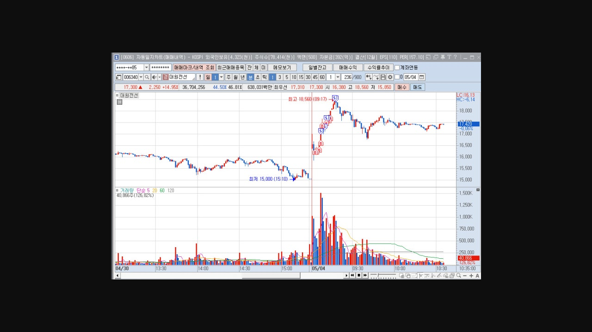

**① 매수 직전 5분간 누적 거래대금 (가속 확인)**

| 시점 | -5분 09:01 | -4분 09:02 | -3분 09:03 | -2분 09:04 | -1분 09:05 | **매수** 09:06 |
|---|---|---|---|---|---|---|
| 누적 | 327억 | 424억 | 514억 | 574억 | 699억 | 955억 |
| 분당Δ | - | +97억 | +90억 | +61억 | +124억 | +257억 |

➡️ **매수 직전 5분간 +629억  vs  매수 후 5분간 +799억 → 🟢선취매**

**② 일중 누적 거래대금 추이 (🔴매수/🔵매도 시점)**

| 구분 | 09:30 | 10:00 | 10:30 | 11:00 | 11:30 | 12:00 | 13:00 | 14:00 | 15:00 | 15:20 |
|---|---|---|---|---|---|---|---|---|---|---|
| 누적(억) | 3,411 | 4,558 | 4,932 | 5,309 | 5,518 | 5,830 | 6,238 | 6,502 | 6,816 | 7,047 |
| 매매 | 🔴🔵 |  |  |  |  |  |  |  |  |  |

매매 시점: 🔴매수 09:00 / 🔵매도 09:17

---

## 2026-05-04 · 삼성전자 (005930)

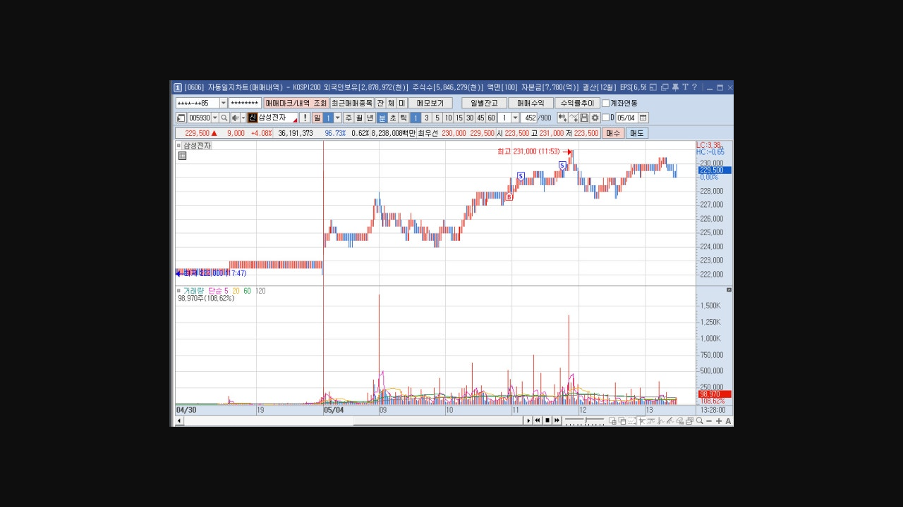

**① 매수 직전 5분간 누적 거래대금 (가속 확인)**

| 시점 | -5분 10:55 | -4분 10:56 | -3분 10:57 | -2분 10:58 | -1분 10:59 | **매수** 11:00 |
|---|---|---|---|---|---|---|
| 누적 | 24,309억 | 25,279억 | 25,363억 | 26,121억 | 26,263억 | 26,559억 |
| 분당Δ | - | +970억 | +84억 | +758억 | +142억 | +296억 |

➡️ **매수 직전 5분간 +2,250억  vs  매수 후 5분간 +855억 → 🔴추격매**

**② 일중 누적 거래대금 추이 (🔴매수/🔵매도 시점)**

| 구분 | 09:30 | 10:00 | 10:30 | 11:00 | 11:30 | 12:00 | 13:00 | 14:00 | 15:00 | 15:20 |
|---|---|---|---|---|---|---|---|---|---|---|
| 누적(억) | 9,977 | 14,694 | 20,623 | 26,559 | 32,843 | 40,562 | 46,898 | 54,165 | 65,080 | 69,172 |
| 매매 |  |  |  | 🔴 | 🔵 |  |  |  |  |  |

매매 시점: 🔴매수 11:00 / 🔵매도 11:30

---

## 2026-05-06 · 미래에셋증권 (006800)

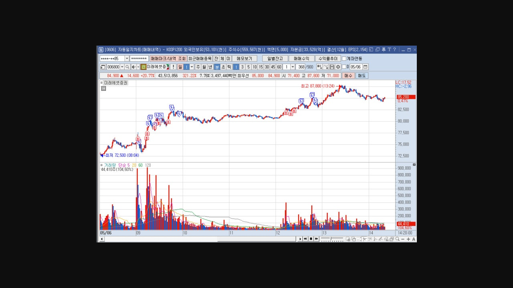

**① 매수 직전 5분간 누적 거래대금 (가속 확인)**

| 시점 | -5분 09:12 | -4분 09:13 | -3분 09:14 | -2분 09:15 | -1분 09:16 | **매수** 09:17 |
|---|---|---|---|---|---|---|
| 누적 | 1,710억 | 1,965억 | 2,317억 | 2,559억 | 2,779억 | 3,112억 |
| 분당Δ | - | +255억 | +353억 | +242억 | +220억 | +333억 |

➡️ **매수 직전 5분간 +1,403억  vs  매수 후 5분간 +651억 → 🔴추격매**

**② 일중 누적 거래대금 추이 (🔴매수/🔵매도 시점)**

| 구분 | 09:30 | 10:00 | 10:30 | 11:00 | 11:30 | 12:00 | 13:00 | 14:00 | 15:00 | 15:20 |
|---|---|---|---|---|---|---|---|---|---|---|
| 누적(억) | 4,896 | 7,704 | 8,687 | 9,308 | 9,652 | 9,976 | 12,356 | 15,013 | 16,128 | 16,626 |
| 매매 | 🔴🔵 |  |  |  |  |  | 🔴🔵 |  |  |  |

매매 시점: 🔴매수 09:17 / 🔵매도 09:30 / 🔴매수 12:45 / 🔵매도 13:24

---

## 2026-05-06 · 대원전선 (006340)

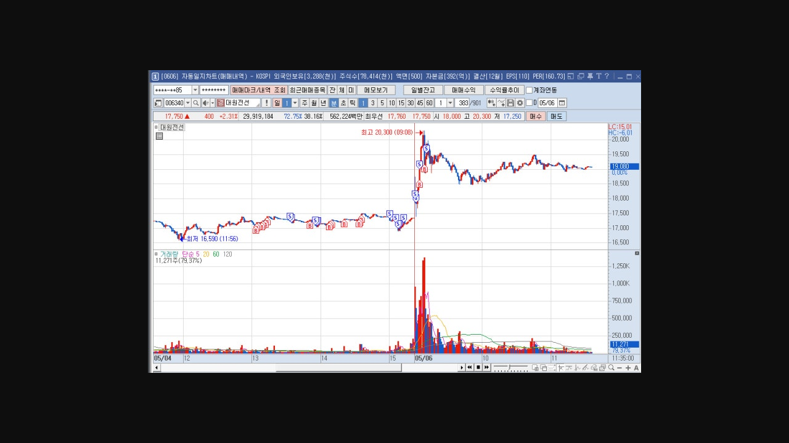

**① 매수 직전 5분간 누적 거래대금 (가속 확인)**

| 시점 | -5분 09:01 | -4분 09:02 | -3분 09:03 | -2분 09:04 | -1분 09:05 | **매수** 09:06 |
|---|---|---|---|---|---|---|
| 누적 | 289억 | 367억 | 468억 | 613억 | 773억 | 789억 |
| 분당Δ | - | +78억 | +101억 | +144억 | +161억 | +16억 |

➡️ **매수 직전 5분간 +500억  vs  매수 후 5분간 +758억 → 🟢선취매**

**② 일중 누적 거래대금 추이 (🔴매수/🔵매도 시점)**

| 구분 | 09:30 | 10:00 | 10:30 | 11:00 | 11:30 | 12:00 | 13:00 | 14:00 | 15:00 | 15:20 |
|---|---|---|---|---|---|---|---|---|---|---|
| 누적(억) | 2,406 | 3,060 | 3,506 | 3,930 | 4,104 | 4,194 | 4,561 | 5,479 | 5,900 | 6,032 |
| 매매 | 🔴🔵 |  |  |  |  |  |  |  |  |  |

매매 시점: 🔴매수 09:00 / 🔵매도 09:08

---

## 2026-05-07 · 삼성전자 (005930)

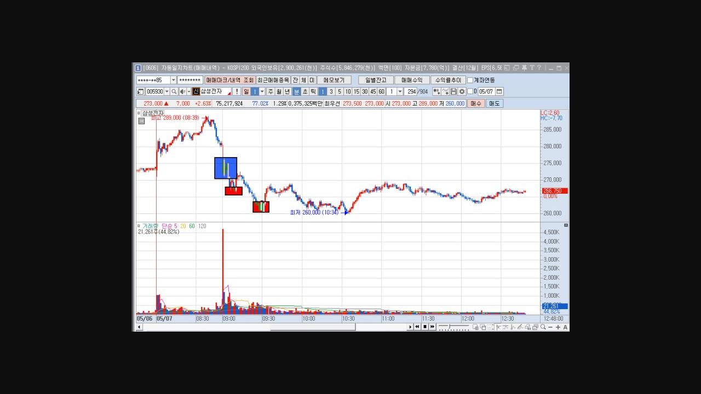

**① 매수 직전 5분간 누적 거래대금 (가속 확인)**

| 시점 | -5분 09:40 | -4분 09:41 | -3분 09:42 | -2분 09:43 | -1분 09:44 | **매수** 09:45 |
|---|---|---|---|---|---|---|
| 누적 | 40,538억 | 40,638억 | 40,936억 | 41,250억 | 41,410억 | 41,476억 |
| 분당Δ | - | +100억 | +298억 | +314억 | +161억 | +66억 |

➡️ **매수 직전 5분간 +938억  vs  매수 후 5분간 +1,387억 → 🟢선취매**

**② 일중 누적 거래대금 추이 (🔴매수/🔵매도 시점)**

| 구분 | 09:30 | 10:00 | 10:30 | 11:00 | 11:30 | 12:00 | 13:00 | 14:00 | 15:00 | 15:20 |
|---|---|---|---|---|---|---|---|---|---|---|
| 누적(억) | 35,887 | 45,309 | 51,602 | 58,745 | 64,009 | 68,040 | 75,382 | 83,652 | 97,480 | 100,608 |
| 매매 | 🔵🔴 | 🔴 |  |  |  |  |  |  |  |  |

매매 시점: 🔵매도 09:35 / 🔴매수 09:45 / 🔴매수 10:00

---

## 2026-05-11 · 현대오토에버 (307950)

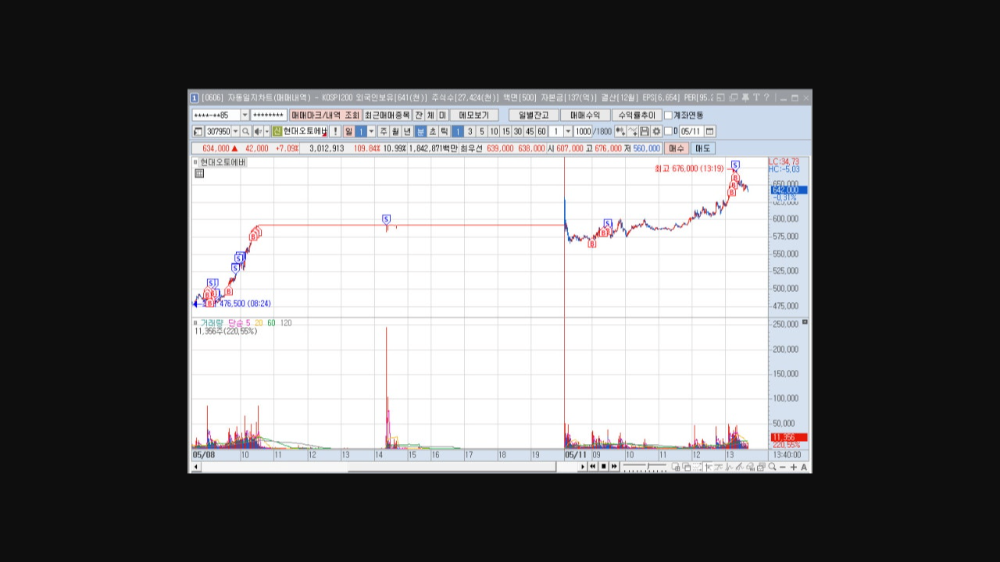

**① 매수 직전 5분간 누적 거래대금 (가속 확인)**

| 시점 | -5분 13:02 | -4분 13:03 | -3분 13:04 | -2분 13:05 | -1분 13:06 | **매수** 13:07 |
|---|---|---|---|---|---|---|
| 누적 | 4,355억 | 4,384억 | 4,420억 | 4,489억 | 4,489억 | 4,603억 |
| 분당Δ | - | +29억 | +36억 | +69억 | +0억 | +114억 |

➡️ **매수 직전 5분간 +248억  vs  매수 후 5분간 +336억 → 🟢선취매**

**② 일중 누적 거래대금 추이 (🔴매수/🔵매도 시점)**

| 구분 | 09:30 | 10:00 | 10:30 | 11:00 | 11:30 | 12:00 | 13:00 | 14:00 | 15:00 | 15:20 |
|---|---|---|---|---|---|---|---|---|---|---|
| 누적(억) | 1,280 | 1,978 | 2,200 | 2,467 | 2,533 | 2,755 | 4,323 | 6,774 | 7,508 | 7,622 |
| 매매 |  |  |  |  |  |  | 🔴🔵 |  |  |  |

매매 시점: 🔴매수 13:07 / 🔵매도 13:19

---

## 2026-05-11 · 대한광통신 (010170)

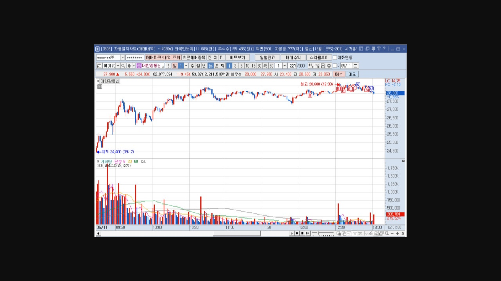

**① 매수 직전 5분간 누적 거래대금 (가속 확인)**

| 시점 | -5분 12:05 | -4분 12:06 | -3분 12:07 | -2분 12:08 | -1분 12:09 | **매수** 12:10 |
|---|---|---|---|---|---|---|
| 누적 | 17,022억 | 17,089억 | 17,153억 | 17,184억 | 17,197억 | 17,209억 |
| 분당Δ | - | +68억 | +64억 | +31억 | +13억 | +12억 |

➡️ **매수 직전 5분간 +187억  vs  매수 후 5분간 +71억 → 🔴추격매**

**② 일중 누적 거래대금 추이 (🔴매수/🔵매도 시점)**

| 구분 | 09:30 | 10:00 | 10:30 | 11:00 | 11:30 | 12:00 | 13:00 | 14:00 | 15:00 | 15:20 |
|---|---|---|---|---|---|---|---|---|---|---|
| 누적(억) | 7,132 | 11,238 | 13,794 | 15,492 | 16,275 | 16,930 | 18,634 | 19,656 | 21,383 | 22,113 |
| 매매 |  |  |  |  |  | 🔴 | 🔵 |  |  |  |

매매 시점: 🔴매수 12:10 / 🔵매도 12:33

---

## 2026-05-11 · SK하이닉스 (000660)

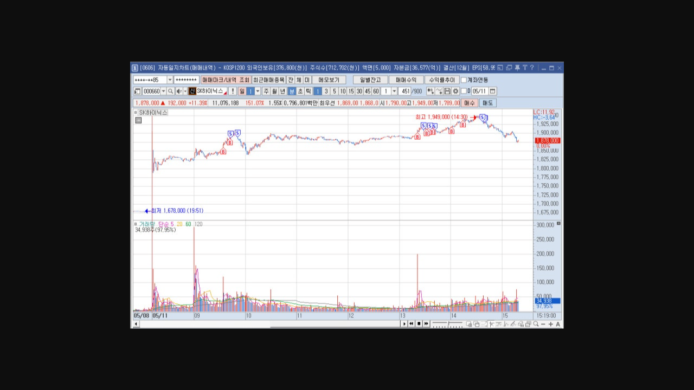

**① 매수 직전 5분간 누적 거래대금 (가속 확인)**

| 시점 | -5분 09:55 | -4분 09:56 | -3분 09:57 | -2분 09:58 | -1분 09:59 | **매수** 10:00 |
|---|---|---|---|---|---|---|
| 누적 | 36,241억 | 36,967억 | 37,589억 | 38,100억 | 38,516억 | 39,193억 |
| 분당Δ | - | +726억 | +622억 | +511억 | +416억 | +677억 |

➡️ **매수 직전 5분간 +2,951억  vs  매수 후 5분간 +2,925억 → ⚪중립**

**② 일중 누적 거래대금 추이 (🔴매수/🔵매도 시점)**

| 구분 | 09:30 | 10:00 | 10:30 | 11:00 | 11:30 | 12:00 | 13:00 | 14:00 | 15:00 | 15:20 |
|---|---|---|---|---|---|---|---|---|---|---|
| 누적(억) | 22,621 | 39,193 | 50,700 | 58,047 | 63,381 | 68,162 | 76,482 | 90,937 | 114,487 | 123,751 |
| 매매 |  | 🔴 | 🔵 | 🔴 |  |  |  | 🔵 |  |  |

매매 시점: 🔴매수 10:00 / 🔵매도 10:20 / 🔴매수 11:00 / 🔵매도 14:30

---

## 2026-05-12 · SK하이닉스 (000660)

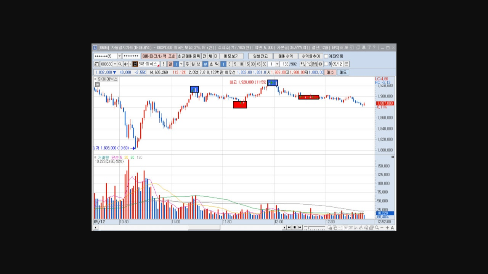

**① 매수 직전 5분간 누적 거래대금 (가속 확인)**

| 시점 | -5분 10:40 | -4분 10:41 | -3분 10:42 | -2분 10:43 | -1분 10:44 | **매수** 10:45 |
|---|---|---|---|---|---|---|
| 누적 | 68,613억 | 69,855억 | 70,845억 | 72,165억 | 73,846억 | 75,264억 |
| 분당Δ | - | +1,242억 | +990억 | +1,320억 | +1,681억 | +1,419억 |

➡️ **매수 직전 5분간 +6,651억  vs  매수 후 5분간 +5,444억 → 🔴추격매**

**② 일중 누적 거래대금 추이 (🔴매수/🔵매도 시점)**

| 구분 | 09:30 | 10:00 | 10:30 | 11:00 | 11:30 | 12:00 | 13:00 | 14:00 | 15:00 | 15:20 |
|---|---|---|---|---|---|---|---|---|---|---|
| 누적(억) | 30,687 | 38,231 | 55,443 | 86,584 | 98,067 | 105,430 | 117,350 | 131,596 | 152,801 | 160,162 |
| 매매 |  |  | 🔴 |  | 🔵 | 🔴 |  |  |  |  |

매매 시점: 🔴매수 10:45 / 🔵매도 11:30 / 🔴매수 12:30

---

## 2026-05-13 · 알테오젠 (196170)

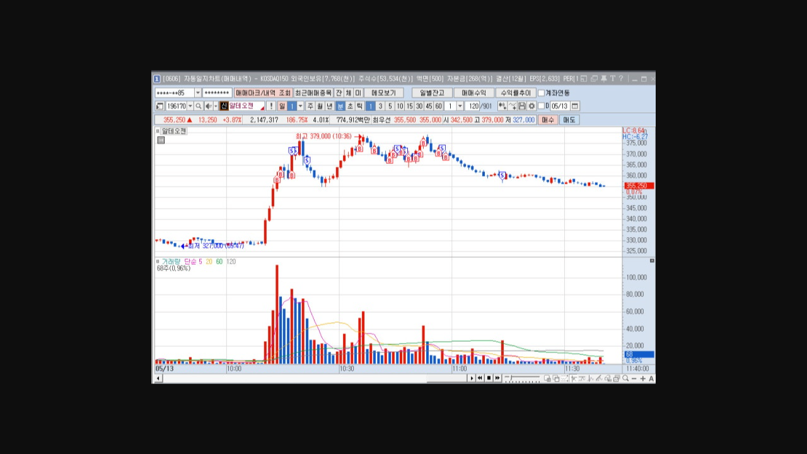

**① 매수 직전 5분간 누적 거래대금 (가속 확인)**

| 시점 | -5분 10:25 | -4분 10:26 | -3분 10:27 | -2분 10:28 | -1분 10:29 | **매수** 10:30 |
|---|---|---|---|---|---|---|
| 누적 | 2,567억 | 2,617억 | 2,651억 | 2,674억 | 2,703억 | 2,738억 |
| 분당Δ | - | +49억 | +35억 | +22억 | +29억 | +35억 |

➡️ **매수 직전 5분간 +171억  vs  매수 후 5분간 +304억 → 🟢선취매**

**② 일중 누적 거래대금 추이 (🔴매수/🔵매도 시점)**

| 구분 | 09:30 | 10:00 | 10:30 | 11:00 | 11:30 | 12:00 | 13:00 | 14:00 | 15:00 | 15:20 |
|---|---|---|---|---|---|---|---|---|---|---|
| 누적(억) | 370 | 556 | 2,738 | 3,966 | 4,287 | 4,458 | 4,614 | 4,774 | 4,904 | 4,968 |
| 매매 |  |  | 🔴🔴🔵🔵 |  |  |  |  |  |  |  |

매매 시점: 🔴매수 10:30 / 🔴매수 10:33 / 🔵매도 10:36 / 🔵매도 10:37

---

## 2026-05-14 · LG씨엔에스 (064400)

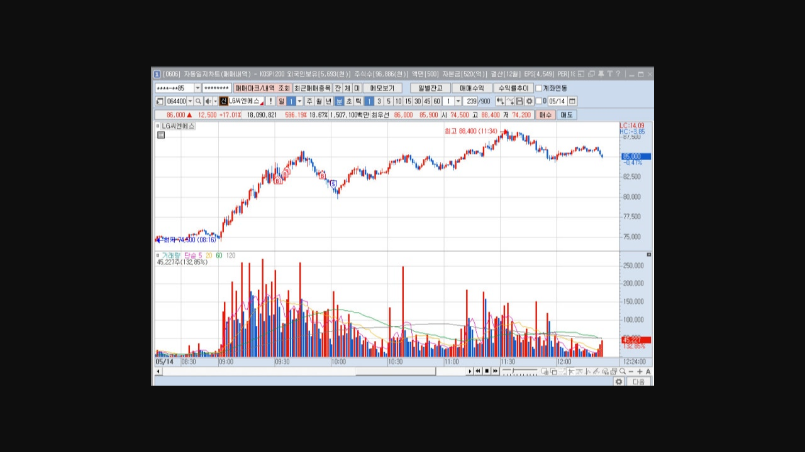

**① 매수 직전 5분간 누적 거래대금 (가속 확인)**

| 시점 | -5분 09:18 | -4분 09:19 | -3분 09:20 | -2분 09:21 | -1분 09:22 | **매수** 09:23 |
|---|---|---|---|---|---|---|
| 누적 | 989억 | 1,035억 | 1,066억 | 1,142억 | 1,186억 | 1,260억 |
| 분당Δ | - | +46억 | +30억 | +76억 | +45억 | +74억 |

➡️ **매수 직전 5분간 +271억  vs  매수 후 5분간 +246억 → ⚪중립**

**② 일중 누적 거래대금 추이 (🔴매수/🔵매도 시점)**

| 구분 | 09:30 | 10:00 | 10:30 | 11:00 | 11:30 | 12:00 | 13:00 | 14:00 | 15:00 | 15:20 |
|---|---|---|---|---|---|---|---|---|---|---|
| 누적(억) | 1,667 | 3,103 | 3,834 | 4,449 | 5,293 | 6,159 | 6,756 | 7,300 | 7,733 | 7,915 |
| 매매 | 🔴🔵 |  |  |  |  |  |  |  |  |  |

매매 시점: 🔴매수 09:23 / 🔵매도 09:45

---

## 2026-05-19 · 아주IB투자 (027360)

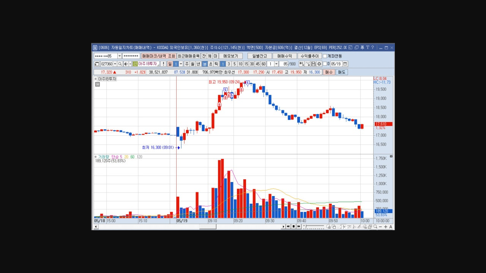

**① 매수 직전 5분간 누적 거래대금 (가속 확인)**

| 시점 | -5분 09:13 | -4분 09:14 | -3분 09:15 | -2분 09:16 | -1분 09:17 | **매수** 09:18 |
|---|---|---|---|---|---|---|
| 누적 | 1,271억 | 1,271억 | 1,271억 | 1,605억 | 1,830억 | 2,101억 |
| 분당Δ | - | +0억 | +0억 | +335억 | +225억 | +271억 |

➡️ **매수 직전 5분간 +831억  vs  매수 후 5분간 +871억 → ⚪중립**

**② 일중 누적 거래대금 추이 (🔴매수/🔵매도 시점)**

| 구분 | 09:30 | 10:00 | 10:30 | 11:00 | 11:30 | 12:00 | 13:00 | 14:00 | 15:00 | 15:20 |
|---|---|---|---|---|---|---|---|---|---|---|
| 누적(억) | 3,721 | 5,378 | 5,950 | 6,257 | 6,399 | 6,512 | 6,712 | 6,803 | 6,951 | 7,067 |
| 매매 | 🔴🔴🔵 |  |  |  |  |  |  |  |  |  |

매매 시점: 🔴매수 09:13 / 🔴매수 09:18 / 🔵매도 09:24

---

## 2026-05-20 · 코스모로보틱스 (439960)

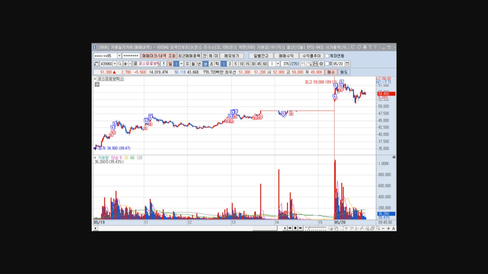

**① 매수 직전 5분간 누적 거래대금 (가속 확인)**

| 시점 | -5분 09:05 | -4분 09:06 | -3분 09:07 | -2분 09:08 | -1분 09:09 | **매수** 09:10 |
|---|---|---|---|---|---|---|
| 누적 | 1,935억 | 2,157억 | 2,295억 | 2,377억 | 2,572억 | 2,745억 |
| 분당Δ | - | +222억 | +138억 | +81억 | +196억 | +173억 |

➡️ **매수 직전 5분간 +810억  vs  매수 후 5분간 +1,097억 → 🟢선취매**

**② 일중 누적 거래대금 추이 (🔴매수/🔵매도 시점)**

| 구분 | 09:30 | 10:00 | 10:30 | 11:00 | 11:30 | 12:00 | 13:00 | 14:00 | 15:00 | 15:20 |
|---|---|---|---|---|---|---|---|---|---|---|
| 누적(억) | 4,918 | 6,301 | 6,986 | 7,711 | 8,384 | 9,374 | 12,335 | 14,589 | 17,401 | 18,274 |
| 매매 | 🔴🔵 |  |  |  |  |  |  |  |  |  |

매매 시점: 🔴매수 09:00 / 🔵매도 09:13

---

## 2026-05-21 · 삼성전자 (005930)

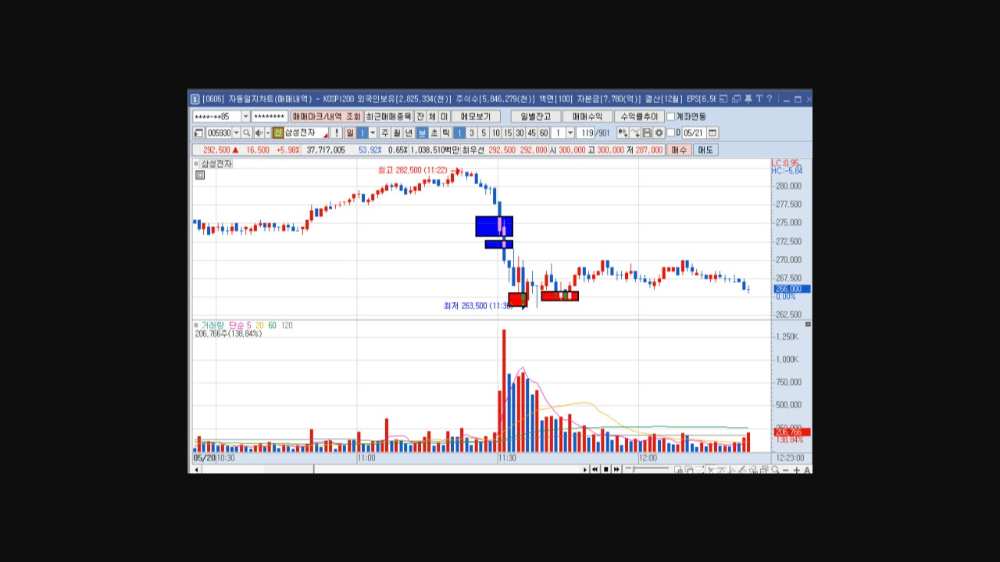

**① 매수 직전 5분간 누적 거래대금 (가속 확인)**

| 시점 | -5분 11:32 | -4분 11:33 | -3분 11:34 | -2분 11:35 | -1분 11:36 | **매수** 11:37 |
|---|---|---|---|---|---|---|
| 누적 | 51,365억 | 51,555억 | 51,615억 | 51,879억 | 51,949억 | 52,220억 |
| 분당Δ | - | +190억 | +60억 | +264억 | +70억 | +271억 |

➡️ **매수 직전 5분간 +855억  vs  매수 후 5분간 +617억 → 🔴추격매**

**② 일중 누적 거래대금 추이 (🔴매수/🔵매도 시점)**

| 구분 | 09:30 | 10:00 | 10:30 | 11:00 | 11:30 | 12:00 | 13:00 | 14:00 | 15:00 | 15:20 |
|---|---|---|---|---|---|---|---|---|---|---|
| 누적(억) | 19,602 | 28,480 | 34,729 | 45,554 | 50,985 | 55,255 | 67,373 | 76,977 | 92,288 | 99,344 |
| 매매 |  |  |  |  | 🔴🔵🔵 |  |  |  |  |  |

매매 시점: 🔴매수 11:37 / 🔵매도 11:22 / 🔵매도 11:40

---

## 2026-05-27 · SK하이닉스 (000660)

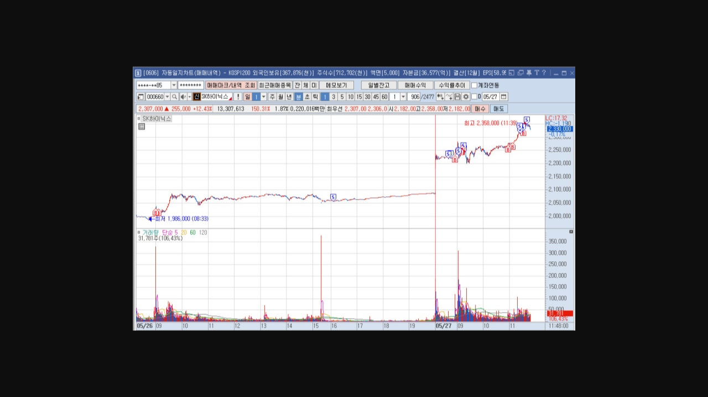

**① 매수 직전 5분간 누적 거래대금 (가속 확인)**

| 시점 | -5분 10:55 | -4분 10:56 | -3분 10:57 | -2분 10:58 | -1분 10:59 | **매수** 11:00 |
|---|---|---|---|---|---|---|
| 누적 | 65,712억 | 66,162억 | 67,221억 | 67,636억 | 68,137억 | 68,666억 |
| 분당Δ | - | +451억 | +1,059억 | +414억 | +501억 | +529억 |

➡️ **매수 직전 5분간 +2,954억  vs  매수 후 5분간 +1,335억 → 🔴추격매**

**② 일중 누적 거래대금 추이 (🔴매수/🔵매도 시점)**

| 구분 | 09:30 | 10:00 | 10:30 | 11:00 | 11:30 | 12:00 | 13:00 | 14:00 | 15:00 | 15:20 |
|---|---|---|---|---|---|---|---|---|---|---|
| 누적(억) | 36,532 | 50,282 | 59,787 | 68,666 | 82,289 | 95,171 | 108,005 | 125,034 | 145,872 | 153,672 |
| 매매 |  |  |  | 🔴 | 🔵 |  |  |  |  |  |

매매 시점: 🔴매수 11:00 / 🔵매도 11:39

---

## 2026-05-27 · LG이노텍 (011070)

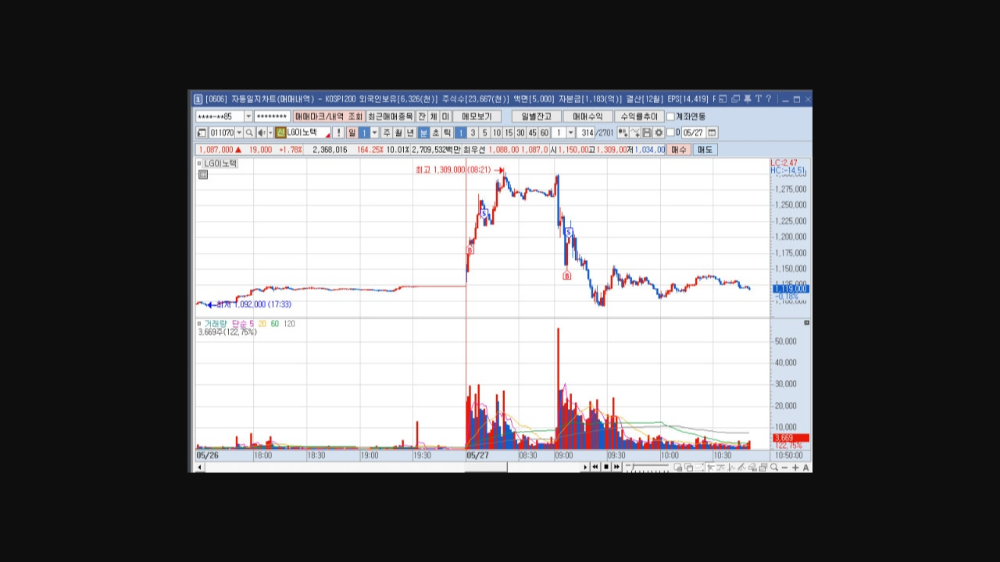

**① 매수 직전 5분간 누적 거래대금 (가속 확인)**

| 시점 | -5분 09:01 | -4분 09:02 | -3분 09:03 | -2분 09:04 | -1분 09:05 | **매수** 09:06 |
|---|---|---|---|---|---|---|
| 누적 | 0억 | 354억 | 565억 | 820억 | 972억 | 1,082억 |
| 분당Δ | - | +354억 | +211억 | +255억 | +152억 | +110억 |

➡️ **매수 직전 5분간 +1,082억  vs  매수 후 5분간 +460억 → 🔴추격매**

**② 일중 누적 거래대금 추이 (🔴매수/🔵매도 시점)**

| 구분 | 09:30 | 10:00 | 10:30 | 11:00 | 11:30 | 12:00 | 13:00 | 14:00 | 15:00 | 15:20 |
|---|---|---|---|---|---|---|---|---|---|---|
| 누적(억) | 3,489 | 4,844 | 5,388 | 5,826 | 6,348 | 6,799 | 7,598 | 9,450 | 10,533 | 10,956 |
| 매매 | 🔴🔵 |  |  |  |  |  |  |  |  |  |

매매 시점: 🔴매수 09:06 / 🔵매도 09:30

---

## 2026-05-28 · SK하이닉스 (000660)

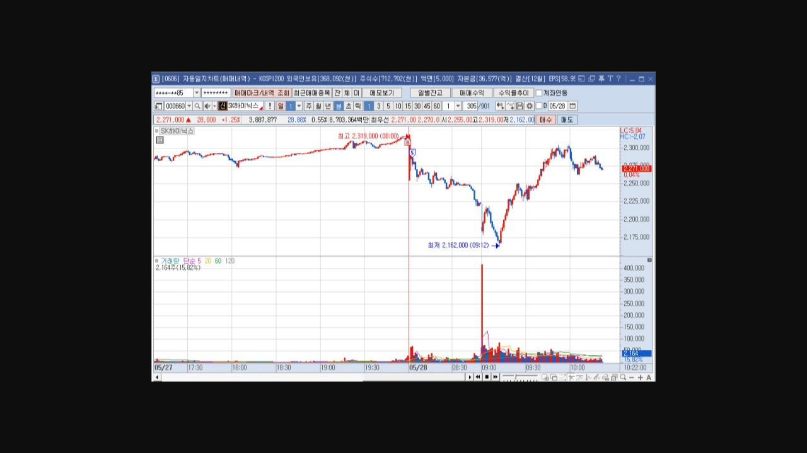

**① 매수 직전 5분간 누적 거래대금 (가속 확인)**

| 시점 | -5분 09:00 | -4분 09:01 | -3분 09:02 | -2분 09:03 | -1분 09:04 | **매수** 09:05 |
|---|---|---|---|---|---|---|
| 누적 | 8,394억 | 9,350억 | 10,300억 | 11,108억 | 11,924억 | 12,755억 |
| 분당Δ | - | +956억 | +949억 | +809억 | +816억 | +831억 |

➡️ **매수 직전 5분간 +4,361억  vs  매수 후 5분간 +3,197억 → 🔴추격매**

**② 일중 누적 거래대금 추이 (🔴매수/🔵매도 시점)**

| 구분 | 09:30 | 10:00 | 10:30 | 11:00 | 11:30 | 12:00 | 13:00 | 14:00 | 15:00 | 15:20 |
|---|---|---|---|---|---|---|---|---|---|---|
| 누적(억) | 27,889 | 41,825 | 49,101 | 57,579 | 61,111 | 64,768 | 80,439 | 98,551 | 114,343 | 122,728 |
| 매매 | 🔴🔵 |  |  |  |  |  |  |  |  |  |

매매 시점: 🔴매수 09:05 / 🔵매도 09:08

---

## 2026-05-28 · 삼성전자 (005930)

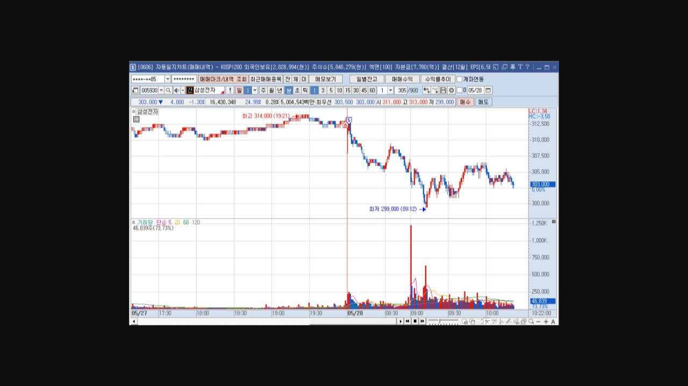

**① 매수 직전 5분간 누적 거래대금 (가속 확인)**

| 시점 | -5분 09:00 | -4분 09:01 | -3분 09:02 | -2분 09:03 | -1분 09:04 | **매수** 09:05 |
|---|---|---|---|---|---|---|
| 누적 | 3,332억 | 3,954억 | 4,186억 | 4,847억 | 5,370억 | 5,645억 |
| 분당Δ | - | +621억 | +232억 | +661억 | +523억 | +275억 |

➡️ **매수 직전 5분간 +2,313억  vs  매수 후 5분간 +1,693억 → 🔴추격매**

**② 일중 누적 거래대금 추이 (🔴매수/🔵매도 시점)**

| 구분 | 09:30 | 10:00 | 10:30 | 11:00 | 11:30 | 12:00 | 13:00 | 14:00 | 15:00 | 15:20 |
|---|---|---|---|---|---|---|---|---|---|---|
| 누적(억) | 14,164 | 21,580 | 26,579 | 31,228 | 34,526 | 39,348 | 51,831 | 67,254 | 80,051 | 85,543 |
| 매매 | 🔵🔴 |  |  |  |  |  |  |  |  |  |

매매 시점: 🔵매도 09:00 / 🔴매수 09:05

---

## 2026-05-28 · 삼성전기 (009150)

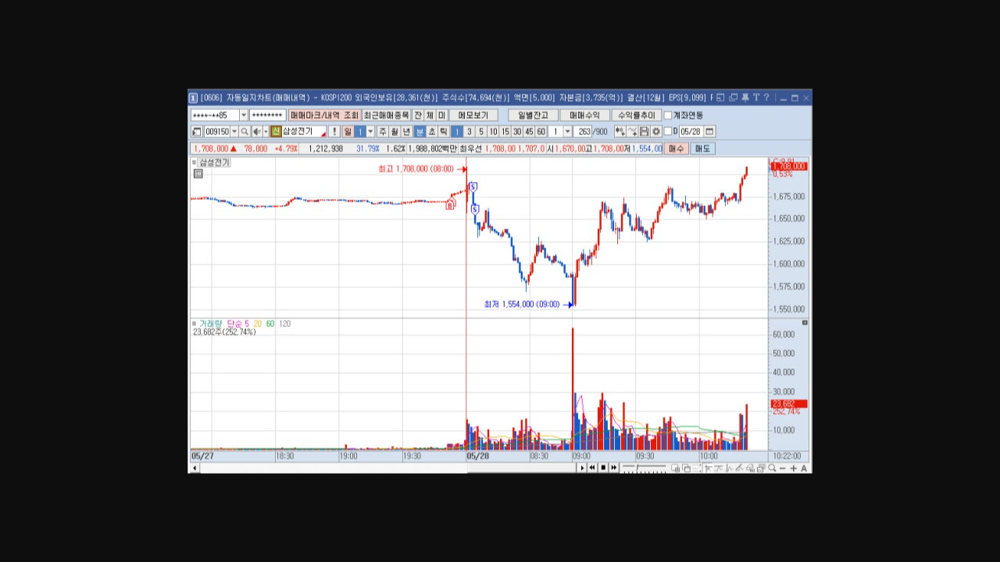

**① 매수 직전 5분간 누적 거래대금 (가속 확인)**

| 시점 | -5분 09:00 | -4분 09:01 | -3분 09:02 | -2분 09:03 | -1분 09:04 | **매수** 09:05 |
|---|---|---|---|---|---|---|
| 누적 | 734억 | 1,099억 | 1,328억 | 1,517억 | 1,672억 | 1,903억 |
| 분당Δ | - | +365억 | +229억 | +190억 | +155억 | +231억 |

➡️ **매수 직전 5분간 +1,169억  vs  매수 후 5분간 +704억 → 🔴추격매**

**② 일중 누적 거래대금 추이 (🔴매수/🔵매도 시점)**

| 구분 | 09:30 | 10:00 | 10:30 | 11:00 | 11:30 | 12:00 | 13:00 | 14:00 | 15:00 | 15:20 |
|---|---|---|---|---|---|---|---|---|---|---|
| 누적(억) | 5,664 | 8,216 | 11,173 | 13,083 | 14,829 | 18,471 | 23,427 | 28,627 | 39,122 | 42,272 |
| 매매 | 🔴🔵 |  |  |  |  |  |  |  |  |  |

매매 시점: 🔴매수 09:05 / 🔵매도 09:08

---
