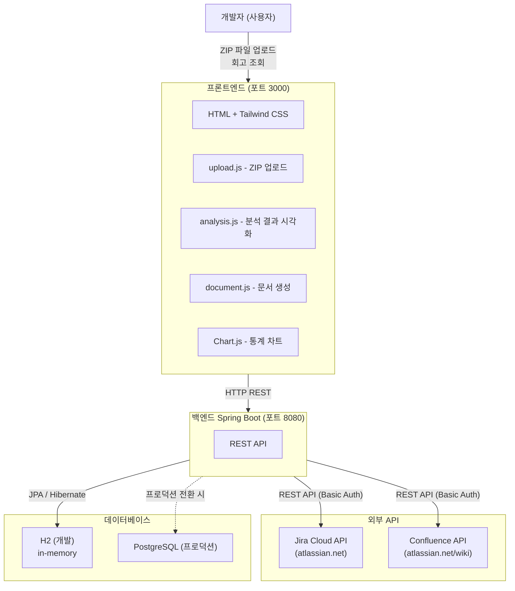
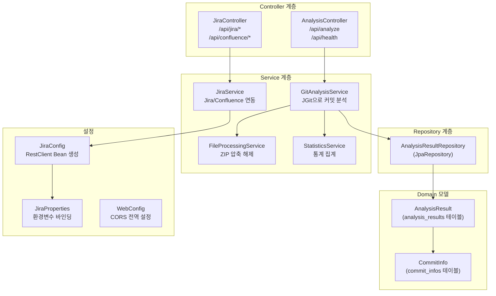
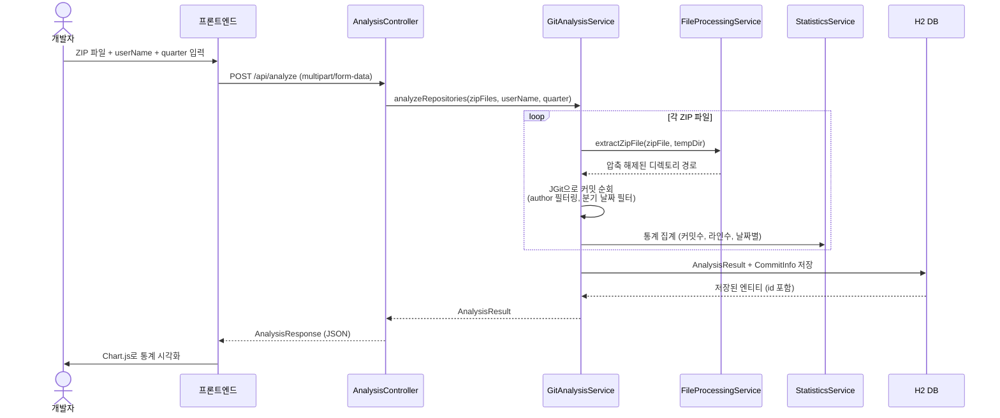
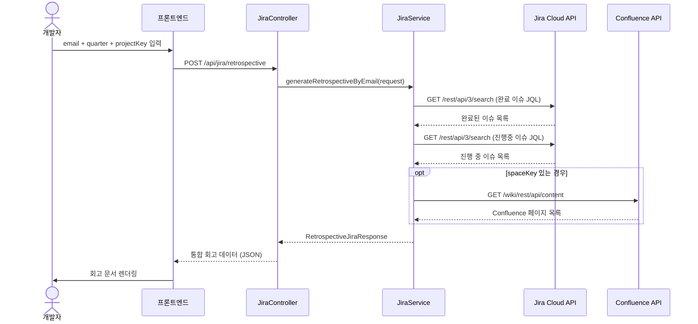
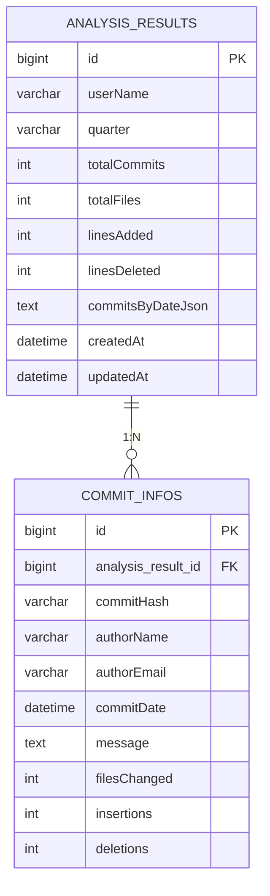

# 원온원(1:1) 회고 생성 시스템 아키텍처

> 개발자의 Git 커밋 이력과 Jira/Confluence 데이터를 분석하여 분기별 회고를 자동 생성하는 시스템

---

## 1. 전체 시스템 아키텍처 (C4 Context)

---

## 2. 백엔드 컴포넌트 다이어그램

---

## 3. 데이터 흐름 - Git 분석 시나리오

---

## 4. 데이터 흐름 - 회고 생성 시나리오 (Jira 연동)

---

## 5. 데이터베이스 ER 다이어그램

---

## 6. API 엔드포인트 목록

| 메서드 | 경로 | 설명 |
|--------|------|------|
| `POST` | `/api/analyze` | Git ZIP 파일 분석 |
| `GET` | `/api/health` | 헬스 체크 |
| `GET` | `/api/jira/status` | Jira 연결 상태 확인 |
| `GET` | `/api/jira/issues` | JQL 직접 검색 |
| `GET` | `/api/jira/issues/mine` | 내 이슈 (currentUser()) |
| `GET` | `/api/jira/issues/done` | 완료된 이슈 |
| `GET` | `/api/jira/issues/in-progress` | 진행 중 이슈 |
| `GET` | `/api/jira/issues/sprint` | 스프린트 이슈 |
| `GET` | `/api/jira/retrospective` | 회고 통합 데이터 (currentUser) |
| `POST` | `/api/jira/retrospective` | 이메일 기반 회고 생성 |
| `GET` | `/api/jira/projects` | 프로젝트 목록 |
| `GET` | `/api/confluence/pages` | Confluence 페이지 조회 |

---

## 7. 환경변수 설정

| 환경변수 | 설명 | 기본값 |
|----------|------|--------|
| `JIRA_BASE_URL` | Jira/Confluence 도메인 | `https://your-company.atlassian.net` |
| `JIRA_EMAIL` | Atlassian 계정 이메일 | (필수) |
| `JIRA_API_TOKEN` | Atlassian API 토큰 | (필수) |
| `JIRA_ENABLED` | Jira 연동 활성화 여부 | `true` |

---

## 8. 기술 스택

| 영역 | 기술 |
|------|------|
| 프론트엔드 | HTML, Tailwind CSS (CDN), Chart.js, Vanilla JS |
| 백엔드 | Spring Boot 3.4.1, Kotlin, JPA/Hibernate |
| Git 분석 | JGit (Eclipse JGit) |
| 데이터베이스 | H2 (개발), PostgreSQL (프로덕션) |
| 외부 연동 | Jira Cloud REST API v3, Confluence REST API |
| 인증 | Basic Auth (email + API token) |
| 빌드 | Gradle (Kotlin DSL) |
