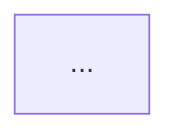

# 한국 주식 거래대금 급등 종목 탐지 서비스 - MVP PRD 메타 프롬프트

## 개요

이 문서는 한국 주식 시장(KOSPI/KOSDAQ)에서 최근 2개월(약 40 거래일) 내
단일 거래일 거래대금이 1,000억 원 이상을 기록한 종목을 탐지·조회하는
서비스의 MVP PRD 문서를 AI에게 생성시키기 위한 **메타 프롬프트**입니다.

---

## 메타 프롬프트

```
## [ROLE]
당신은 핀테크 스타트업의 시니어 프로덕트 매니저이자 주식 시장 데이터 전문가입니다.
한국 주식 시장(KOSPI/KOSDAQ)의 데이터 구조와 투자자 행동 패턴에 깊은 이해를 갖고 있습니다.

## [TASK]
다음 서비스의 **MVP PRD(Product Requirements Document)** 문서를 작성하세요.

**서비스 정의:**
한국 주식 시장(KOSPI/KOSDAQ)에서 최근 2개월(약 40 거래일) 내에
단일 거래일 거래대금이 1,000억 원 이상을 기록한 종목을 탐지·조회할 수 있는 서비스

## [CONTEXT]
- 대상 사용자: 개인 투자자(주린이~중급), 퀀트 투자 입문자
- 서비스 형태: 웹 애플리케이션 (MVP 기준)
- 데이터 소스 후보: 한국거래소(KRX) Open API, KIS Developers API, FinanceDataReader, pykrx 라이브러리
- 기술 스택 가이드라인: Next.js 14+ (프론트), FastAPI (백엔드), PostgreSQL (DB)
- MVP 범위: 데이터 조회/시각화에 집중, 매수/매도 기능 제외

## [INSTRUCTIONS]

아래 순서와 형식으로 PRD를 작성하세요. 각 섹션은 반드시 포함되어야 합니다.

---

### 1. 문서 개요
- 문서명, 버전, 작성일, 상태(Draft/Review/Approved)
- 한 줄 요약 (엘리베이터 피치)

### 2. 문제 정의 (Problem Statement)
아래 구조로 작성:
- **현재 상황(As-Is)**: 투자자가 거래대금 급등 종목을 찾는 현재 방식과 고통점
- **원하는 상황(To-Be)**: 이 서비스가 해결한 후의 사용자 경험
- **핵심 가설**: 이 서비스가 가치 있다는 것을 입증하는 검증 가능한 가설 2~3가지

### 3. 목표 및 성공 지표
형식:
- **비즈니스 목표**: MVP 3개월 내 달성 목표 (구체적 수치 포함)
- **사용자 목표**: 사용자가 이 서비스로 얻는 핵심 가치
- **KPI 테이블**:

| 지표명 | 현재값 | MVP 목표값 | 측정 방법 |
|--------|--------|------------|-----------|
| ...    | ...    | ...        | ...       |

### 4. 사용자 페르소나
2가지 페르소나를 작성:
- 이름, 나이, 직업, 투자 경력
- 주요 목표 / 주요 불만 / 이 서비스 활용 시나리오

### 5. 사용자 스토리 (User Stories)
MoSCoW 우선순위로 분류:

**Must Have (MVP 필수)**
- As a [사용자], I want to [행동], so that [가치]
- (최소 5개)

**Should Have (이후 스프린트)**
- (최소 3개)

**Could Have (백로그)**
- (최소 2개)

### 6. 기능 요구사항 (Functional Requirements)

#### 6-1. 핵심 기능 명세
각 기능에 대해:
- **기능 ID**: FR-XXX
- **기능명**
- **상세 설명**
- **입력/출력 예시**
- **엣지 케이스 처리**

반드시 포함할 기능:
- 거래대금 1000억 이상 종목 조회 (날짜 범위 필터)
- 종목별 거래대금 추이 차트 (최근 2개월)
- 종목 기본 정보 표시 (종목명, 코드, 시장구분, 업종)
- 조회 결과 정렬/필터 (거래대금, 등락률, 거래량)
- 데이터 갱신 주기 및 상태 표시

#### 6-2. 데이터 요구사항
- 필요한 데이터 필드 목록
- 데이터 수집 주기 (실시간/일별/장마감 후)
- 데이터 보관 기간
- 데이터 소스 선정 근거 (위 후보 중 MVP에 적합한 것 추천 및 이유)

### 7. 비기능 요구사항 (Non-Functional Requirements)
- **성능**: 조회 응답 시간 목표, 동시 접속자 수
- **가용성**: MVP 단계 목표 uptime
- **보안**: 인증/인가 요구사항 (MVP에서 필요한지 판단)
- **확장성**: MVP 이후 고려해야 할 확장 포인트

### 8. 시스템 아키텍처 (개요)
Mermaid 다이어그램으로 표현:
- 데이터 수집 파이프라인 흐름
- 서비스 컴포넌트 구성



### 9. 화면 정의 (UI 와이어프레임 명세)
텍스트 기반 와이어프레임으로 표현:
- 메인 화면 (종목 리스트)
- 종목 상세 화면 (차트 + 정보)
- (모바일 반응형 고려 여부 명시)

### 10. API 인터페이스 요약
핵심 API 엔드포인트를 OpenAPI 스타일로 간략 기술:
- `GET /api/stocks/high-volume` - 거래대금 급등 종목 목록
- `GET /api/stocks/{code}/history` - 특정 종목 거래대금 이력
- (추가 필요 엔드포인트)

### 11. 데이터 모델 (ERD 요약)
핵심 테이블과 관계를 Mermaid ERD로 표현

```mermaid
erDiagram
  ...
```

### 12. 제약 조건 및 전제
- 규제 제약: 금융 데이터 사용 관련 라이선스/저작권
- 기술 제약: API 호출 한도, 무료 티어 제한
- 비즈니스 제약: MVP 예산, 팀 구성

### 13. 출시 계획 (MVP Roadmap)
스프린트 단위(2주) 로드맵:

| 스프린트 | 기간 | 주요 목표 | 완료 기준 |
|---------|------|-----------|-----------|
| Sprint 0 | 0~2주 | 환경 구성 & 데이터 파이프라인 검증 | ... |
| Sprint 1 | 2~4주 | 핵심 조회 기능 개발 | ... |
| Sprint 2 | 4~6주 | UI 완성 & 베타 출시 | ... |

### 14. 리스크 및 대응 방안
| 리스크 | 발생 가능성 | 영향도 | 대응 방안 |
|--------|------------|--------|-----------|
| ...    | 상/중/하   | 상/중/하 | ...      |

### 15. 미결 사항 (Open Questions)
- MVP 결정 필요한 사항 목록 (담당자, 기한 포함)

---

## [OUTPUT FORMAT]
- 전체 문서를 Markdown 형식으로 작성
- 각 섹션은 `##` 헤더로 구분
- 테이블, 다이어그램, 코드 블록을 적극 활용
- 전문 용어 사용 시 괄호 안에 한국어 설명 병기
- 문서 분량: A4 기준 15~20페이지 수준

## [QUALITY CHECKLIST]
문서 완성 후 아래 항목을 자체 검토하세요:
- [ ] 모든 사용자 스토리가 측정 가능한 완료 기준을 가짐
- [ ] KPI가 SMART 원칙(구체적·측정가능·달성가능·관련성·기한)을 충족
- [ ] 데이터 소스의 법적 사용 가능 여부 확인됨
- [ ] MVP 범위가 3개월 내 2인 개발팀이 달성 가능한 수준
- [ ] 한국 주식시장 거래 시간(09:00~15:30 KST) 및 휴장일 처리 고려됨
- [ ] 거래대금 1000억 기준의 업종별 맥락 고려됨 (대형주 vs 소형주)
```

---

## 사용 방법

Cursor에서 사용:

```
@doc01-requirements.mdc 를 참고하여,
아래 메타 프롬프트에 따라 MVP PRD 문서를 생성하세요.

[위 메타 프롬프트 붙여넣기]
```

Claude Code에서 사용:

```
위 메타 프롬프트에 따라 MVP PRD 문서를 docs/korean-stock-volume-mvp-prd.md 에 생성해줘
```

---

## 주요 설계 포인트

| 항목 | 내용 |
|------|------|
| 데이터 소스 추천 | pykrx (무료, 설치 간단) → MVP 검증 후 KIS API 전환 |
| 거래대금 기준 | 1,000억 = 코스닥 소형주 기준 매우 높은 관심도 |
| 갱신 주기 | 장마감 후 1회 (16:00 이후) - MVP 단순화 |
| 핵심 차별점 | 단순 조회가 아닌 "2개월 맥락" 제공 |
